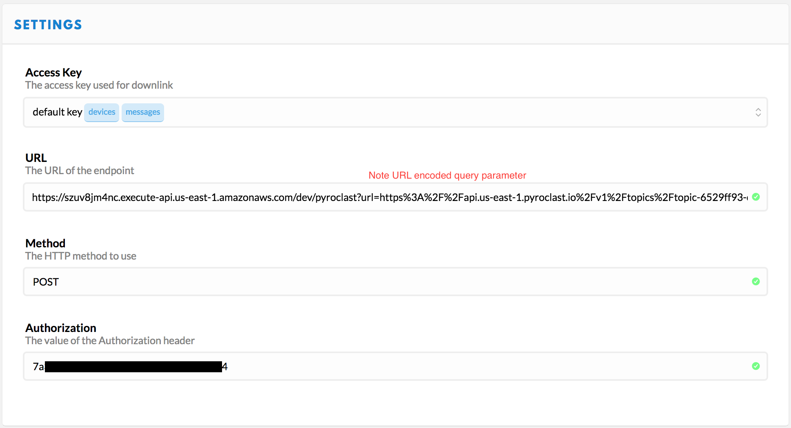
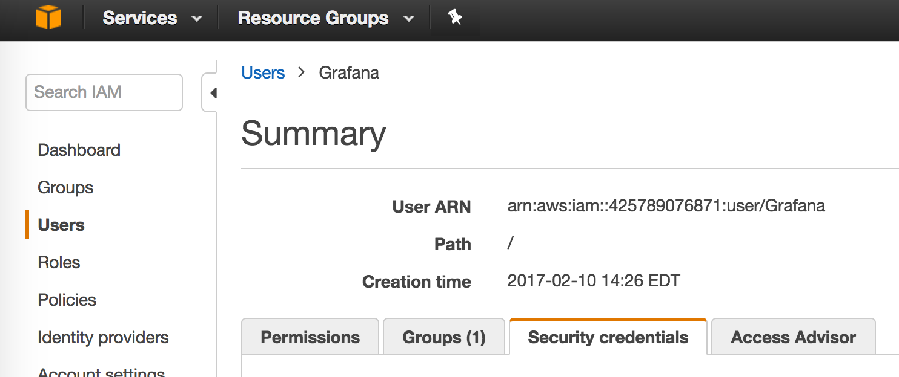

<!--
title: Serverless TTN POST Adapter
description: Adapts the TTN HTTP Integration for use with other cloud data services.
layout: Doc
-->
# Serverless TTN POST Adapter

This project demonstrates how to connect the TTN HTTP Integration to
work with a wide variety of cloud data services *without* running your own server.
The current adapter supports
[Adafruit IO](https://io.adafruit.com),
[OpenSensors](https://www.opensensors.io/),
[SlicingDice](https://slicingdice.com/),
and [Pyroclast](http://pyroclast.io/).

The service uses [AWS Lambda](https://aws.amazon.com/lambda/) to host a
conversion and relay function and the
[Serverless](https://serverless.com/)
command line tools to simplify deployment.

The advantages of going serverless are cost and capacity. At current
pricing 1,000,000 posts will cost $0.10 per month. At low data rates, running
Lambda functions can be much cheaper than running your own server to perform
simple operations. As your data rates increase, the same Lambda function will
work for 1 billion per month (~1m per hour). Of course it will cost more
(like, ~$100/mo), but it won't fail and won't force you to make system changes
while your service is gaining users. Also, you pay for only the requests that
get made - you don't have to provision service ahead of time to handle bursts
of traffic.

## Discussion

The TTN HTTP Integration produces a JSON object.
If you take advantage of the Custom Payload Formats option on the TTN console
your data will be parsed and sitting in a map under the `payload_fields` key
of the JSON object.

Cloud databases generally accept JSON posted data, but with their own formats
and constraints.

- [OpenSensors](https://www.opensensors.io/) will accept an object of the
form `{"data": message}`, where `message` itself is *not* a JSON object.
The post is rejected if there are any keys other than `data` in the object.
(Don't forget the double slash `//` following `topics` in the post URL.
It won't work without it (example: `https://realtime.opensensors.io/v1/topics//users/username/device`))
- [SlicingDice](https://slicingdice.com/) requires a POST to be structured as
an entity insertion.
```json
{
  "my-device-id": {
    "device-name": "my device name",
    "temperature": [
        {
            "value": 25,
            "date": "2017-05-26T12:54:12Z"
        }
    ],
    "table": "sensor-data"
  },
  "auto-create": ["table", "column"]
}
```
- [Pyroclast](http://pyroclast.io/) accepts a deep JSON object, but the root
object has to be of the form `{"value": data-object}` with your data under
the `value` key. Other root level keys are ignored, though the the point of
adding a wrapping layer was likely to support adding keys at the root to
control processing, so this is likely to change.
- [Adafruit IO](https://io.adafruit.com) accepts a JSON object with `value`
and `created_at` fields. The REST URL includes the username and feed name,
like `https://io.adafruit.com/api/v2/username/feeds/feedname/data`.
Also, Adafruit uses an `X-AIO-Key` instead of `Authorization`.

## Usage

In the TTN Console for your app, you set up an HTTP Integration that points to
the Lambda function. A parameter on that URL specifies the destination where
the transformed JSON should be posted.

The `Authorization` key specified in the TTN HTTP Integration is passed through
to the ultimate database API POST. Therefore you don't have to embed a key in
the Lambda code.

Unless you're using one of the databases this adapter already handles, you'll
have to write your conversion code in the `handler.js` file and add an event
specification in the `serverless.yml` configuration file.

### TTN Integration

1. Create and view an app in the TTN [console](https://console.thethingsnetwork.org/applications).
1. Add an HTTP Integration.
1. Choose the "default key" for Access Key, or a more restricted one that has
access to messages only if you've set that up.
1. Create the URL by concatenating
  - The service URL `https://szuv8jm4nc.execute-api.us-east-1.amazonaws.com/dev/pyroclast`
  - The string `?url=`
  - URL encoded destination URL: `https%3A%2F%2Fapi.us-east-1.pyroclast.io%2Fv1%2Ftopics%2Ftopic-xxxxxxxx-xxxx-xxxx-xxxx-xxxxxxxxxxxx%2Fproduce`
1. Paste the result in the URL field.
1. Choose `POST` for method.
1. Paste the Authorization key value from your database provider into the Authorization field.

It should look something like this when you're done:


## Local Setup

In order to modify and deploy your own version of the code, you will need to
perform the following setup steps.

- Install AWS command line tools
- Install Node & NPM
- Install the Serverless command line tools.
```bash
npm install serverless -g
```
- If using AWS IAM Access Management (as opposed to using your main Amazon
  account credentials), you will need to add permissions that allow Serverless
  to do its job. See [below](#aws-iam-policies) for details.
- Clone this repo to your local machine

## Deploy

In order to deploy the function run:

```bash
serverless deploy
```

The expected result should be similar to:

```bash
Serverless: Creating Stack…
Serverless: Checking Stack create progress…
.....
Serverless: Stack create finished…
Serverless: Packaging service…
Serverless: Uploading CloudFormation file to S3…
Serverless: Uploading service .zip file to S3…
Serverless: Updating Stack…
Serverless: Checking Stack update progress…
................
Serverless: Stack update finished…

Service Information
service: ttn-post-adapter
stage: dev
region: us-east-1
api keys:
  None
endpoints:
  POST - https://szrf8jm4nc.execute-api.us-east-1.amazonaws.com/dev/rename
  POST - https://szrf8jm4nc.execute-api.us-east-1.amazonaws.com/dev/opensensors
  POST - https://szrfv8jm4nc.execute-api.us-east-1.amazonaws.com/dev/slicingdice
  POST - https://szrf8jm4nc.execute-api.us-east-1.amazonaws.com/dev/pyroclast
  POST - https://szuv8jm4nc.execute-api.us-east-1.amazonaws.com/dev/adafruit
functions:
  ttn-post-adapter-dev-index: arn:aws:lambda:us-east-1:372342378620:function:ttn-post-adapter-dev-index
```

By default, deployments go to stage `dev`. You'll note the `/dev/` part of the
path in the endpoints. Once everything is working right, you'll want to deploy
to a more permanent environment, like `production` or `v1`. To do that, simply
set the stage on the deploy command line.

`serverless --stage v1 deploy`

## Adding your own handler

There are two steps required to add your own adapter for, say, `favoritedb`.

1. Add an section to the `serverless.yml` under the `- events` key specifying
the path name for your adapter.

  ```yaml
      - http:
          path: favoritedb
          method: post
  ```

2. Define your handler function. It must use the same name as your path
specification to be found by the existing logic.
> All current handlers use the `makeWithModulator` function to perform
> common work like parsing the `event.body` to JSON, posting the transformed JSON,
> and constructing the response object.

  ```js
  handler.favoritedb = makeWithModulator(function (event, context, data, cb) {
    // Transform data as appropriate
    cb(null, data);
  });
  ```

## Testing from the command line

The following command lines assume you have defined the appropriate variables
in a file called `.env`. (I do that and include it in .gitignore in order to
avoid accidentally posting app keys to a public repo.)

My `.env` file looks something like this:

    OPENSENSORS_TOPIC_URL=https://realtime.opensensors.io/v1/topics//users/username/topicpath/temperature?client-id=XXXX&password=XXXXXXXX
    OPENSENSORS_AUTH_HEADER="api-key <uuid key>"
    SLICINGDICE_AUTH_HEADER=<very long key>
    PYROCLAST_TOPIC_URL=https://api.us-east-1.pyroclast.io/v1/topics/topic-xxxxxxxx-xxxx-xxxx-xxxx-xxxxxxxxxxxx/produce
    PYROCLAST_AUTH_HEADER=<uuid key>
    SLS_DEBUG="'*'"

> Make sure to include at least the Serverless debug flag `SLS_DEBUG="'*'"`
in the `.env` file in order to see debug output from your code when you
run it locally.

> The ```( . .env ; env -S "`cat .env`" command args )``` sucks vars out of a
file and makes them available both on the command line and in the execution environment.

> I couldn't use single quotes below because they prevent $VAR expansion.
I wanted a command that could be copied directly from this document
and pasted into the terminal without exposing any of my private keys.

> You could skip one level of escaping below by putting your data
in a file and passing it in with `serverless invoke --path data.json`.
You lose $VAR expansion, but as long as you're not committing the doc to
a repo your keys are as safe there as they are in the `.env` file.

> Lastly, without the `local` parameter, `serverless invoke` invokes the
deployed version of the function on AWS.

OpenSensors test

```bash
( . .env ; env -S "`cat .env`" serverless invoke local --log --function index \
  --data "{\"body\": \"{\\\"payload_fields\\\": {\\\"temperature\\\": 25}}\", \
  \"queryStringParameters\": {\"dataname\": \"data\", \
  \"url\": \"$OPENSENSORS_TOPIC_URL\"}, \
  \"headers\": {\"Authorization\": \"$OPENSENSORS_AUTH_HEADER\"}, \"path\": \"/opensensors\"}")
```

The expected result is

```json
{
    "statusCode": 200,
    "body": "{\"message\":\"Message sent\"}"
}
```

SlicingDice test

```bash
( . .env ; env -S "`cat .env`" serverless invoke local --log --function index \
  --data "{\"body\": \"{\\\"metadata\\\":{\\\"time\\\":\\\"2017-06-14T16:15:41.169291958Z\\\"}, \
  \\\"payload_fields\\\": {\\\"temperature\\\": 26.5}}\", \
  \"queryStringParameters\": { \
  \"url\": \"https://api.slicingdice.com/v1/test/insert\"}, \
  \"headers\": {\"Authorization\": \"$SLICINGDICE_AUTH_HEADER\"}, \"path\": \"/slicingdice\"}")
```

The expected result is

```json
{
    "statusCode": 200,
    "body": "{\"status\":\"success\",\"inserted-entities\":1,\"warning\":\"Using TEST endpoint. Remember to change to the api.slicingdice.com/v1/ endpoint before going to production.\",\"inserted-values\":1,\"took\":0.118}"
}
```

Pyroclast test

```bash
( . .env ; env -S "`cat .env`" serverless invoke local --log --function index \
  --data "{\"body\": \"{\\\"payload_fields\\\": {\\\"temperature\\\": 26.5}}\", \
  \"queryStringParameters\": {\"dataname\": \"value\", \
  \"url\": \"$PYROCLAST_TOPIC_URL\"}, \
  \"headers\": {\"Authorization\": \"$PYROCLAST_AUTH_HEADER\"}, \"path\": \"/pyroclast\"}")
```

The expected result is

```json
{
    "statusCode": 200,
    "body": "{\"created\":true}"
}
```

Adafruit test

```bash
( . .env ; env -S "`cat .env`" serverless invoke local --log --function index \
  --data "{\"body\": \"{\\\"metadata\\\":{\\\"time\\\":\\\"2017-06-14T16:15:41.169291958Z\\\"}, \
  \\\"payload_fields\\\": {\\\"temperature\\\": 26.5}}\", \
  \"queryStringParameters\": {\"field\": \"temperature\", \
  \"url\": \"$ADAFRUIT_URL\"}, \
  \"headers\": {\"Authorization\": \"$ADAFRUIT_AUTH_HEADER\"}, \"path\": \"/adafruit\"}")
```

The expected result is

```json
{
    "statusCode": 200,
    "body": "{
      \"id\":\"0DKT4Y7X3CGCV1E262FXSM76SZ\",
      \"value\":\"26.5\",\"feed_id\":682645,
      \"created_at\":\"2017-06-14T16:15:41Z\",
      \"location\":null,\"lat\":null,\"lon\":null,\"ele\":null,
      \"created_epoch\":1497456941,
      \"expiration\":\"2017-07-16T06:14:12Z\"}"
}
```

## AWS IAM Policies

The serverless tools run under an AWS user identity. Best practice is to
use the IAM service to create a new user with restricted access to services
and resources.

The following script will create a user and apply the policies required to
successfully run `serverless deploy`.

1. Log in as your primary AWS identity (using `aws configure`) Alternatively,
you could use any identity with sufficient permission to perform these
policy changes. (Permissions defined in policies/IAMPolicySetting.json)
2. Run the script using whatever name you prefer instead of TTNPostUsername
```bash
IAMUSER=TTNPostUsername
aws iam create-user --user-name $IAMUSER
aws iam attach-user-policy --policy-arn "arn:aws:iam::aws:policy/AWSLambdaFullAccess" --user-name $IAMUSER
aws iam attach-user-policy --policy-arn "arn:aws:iam::aws:policy/AmazonAPIGatewayInvokeFullAccess" --user-name $IAMUSER
aws iam attach-user-policy --policy-arn "arn:aws:iam::aws:policy/service-role/AmazonAPIGatewayPushToCloudWatchLogs" --user-name $IAMUSER
aws iam attach-user-policy --policy-arn "arn:aws:iam::aws:policy/AmazonAPIGatewayAdministrator" --user-name $IAMUSER
aws iam attach-user-policy --policy-arn "arn:aws:iam::aws:policy/AWSCloudFormationReadOnlyAccess" --user-name $IAMUSER
aws iam put-user-policy --policy-name ServerlessLogs --policy-document file://policies/ServerlessLogs.json --user-name $IAMUSER
aws iam put-user-policy --policy-name ServerlessCloudFormation --policy-document file://policies/ServerlessCloudFormation.json --user-name $IAMUSER
aws iam put-user-policy --policy-name ServerlessIAM --policy-document file://policies/ServerlessIAM.json --user-name $IAMUSER
```
3. Use `aws configure` again and set the new user security credentials.
This causes you to begin interacting with AWS as the new user identity.
You can find the credentials under the Security tab in the
[AWS IAM Console](https://console.aws.amazon.com/iam/home#/users).

4. Now run `serverless deploy`


## Document History

- 2017-06-14 - Initial version
- 2017-06-15 - Added Adafruit IO database adapter
- 2017-06-16 - Added scripts for policy setting

## Copyright

Copyright (c) 2017 Frank Leon Rose
